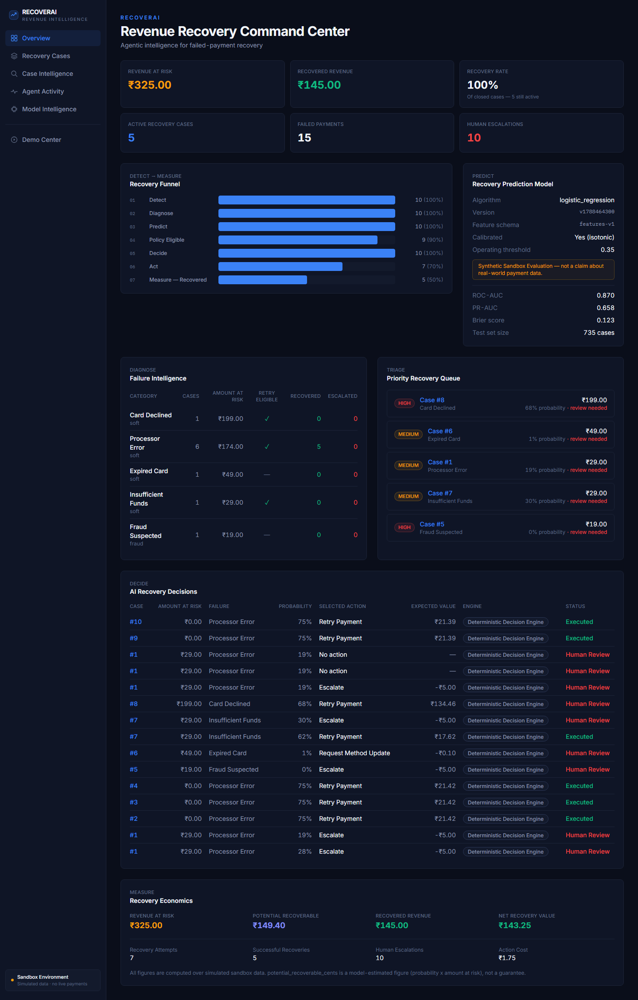
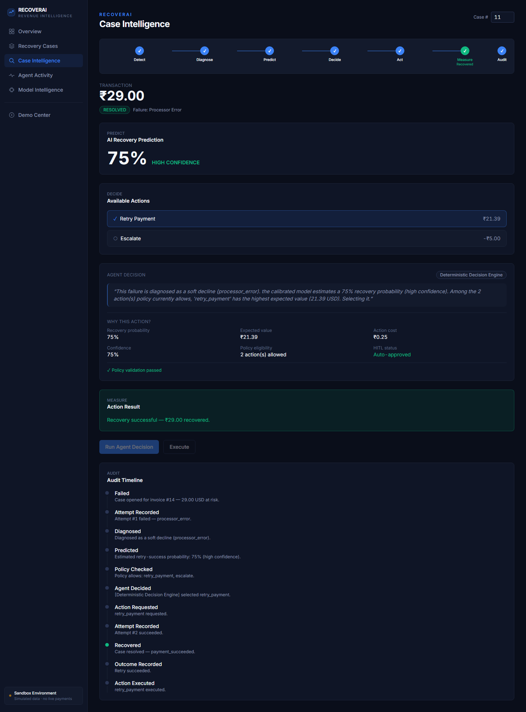
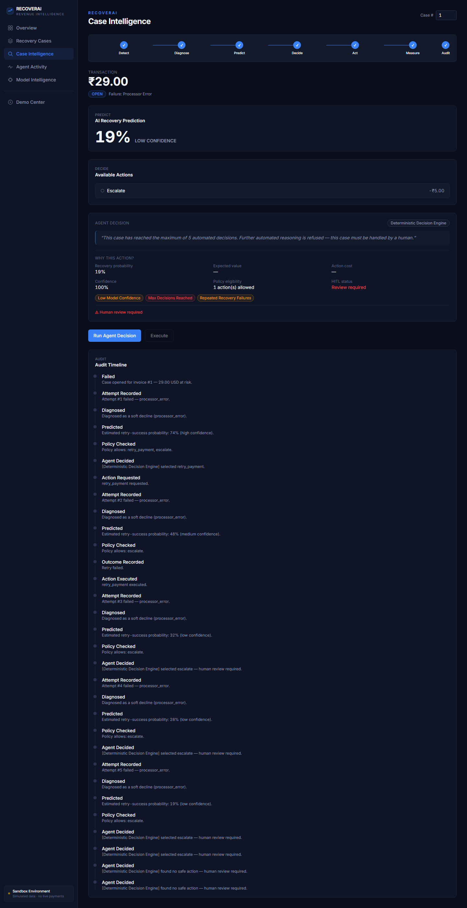
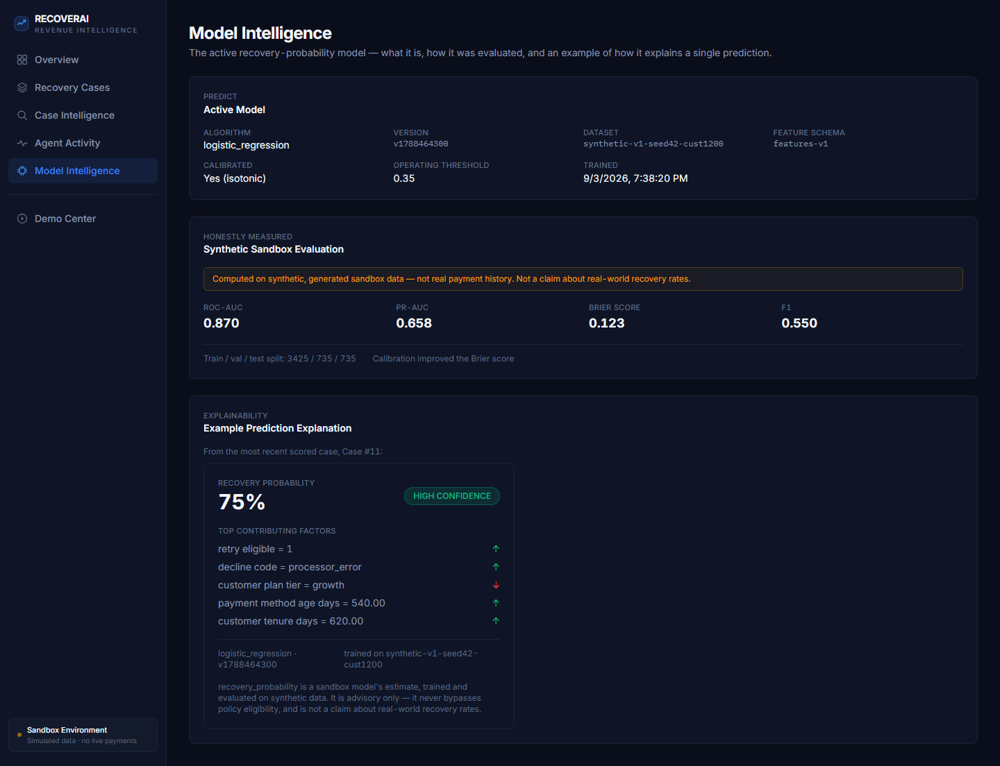
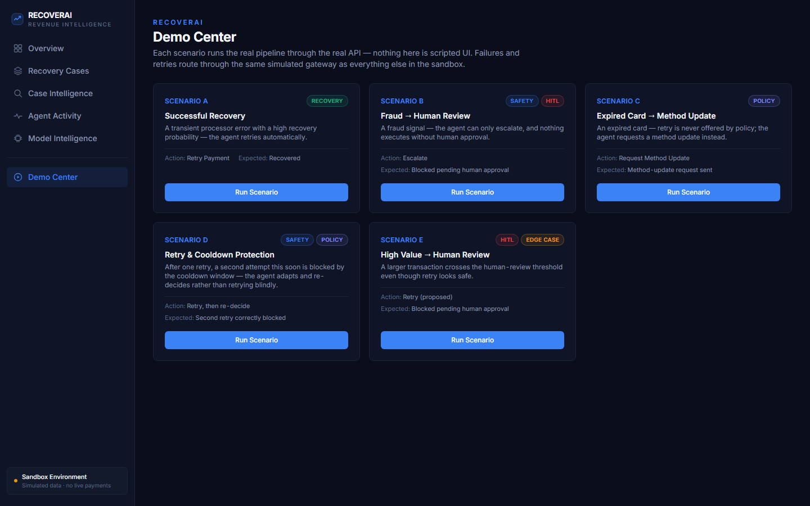

# RecoverAI

Agentic Revenue Recovery & Payment Failure Intelligence Platform.

> RecoverAI combines calibrated ML prediction, deterministic financial
> safety policies, constrained agent reasoning, controlled recovery
> execution, and complete auditability to recover revenue safely.

## Status

**Phases 1–4 are implemented.** Pipeline: Detect → Diagnose → Predict →
Decide → Act → Measure → Learn → Audit, plus an executive dashboard and a
polished Case Intelligence view over the same data. Not production-ready —
see [Synthetic Data Disclaimer](#synthetic-data-disclaimer) and
[Known Limitations](#known-limitations-and-honest-caveats).

## Problem

Recurring-revenue businesses lose money to failed payments — expired
cards, insufficient funds, processor errors, fraud holds. Naive retry
schedules recover some of it, but retry hopeless charges at real cost,
ignore card-network retry-abuse penalties, and give finance no way to see
*why* revenue was lost or *why* any given action was taken.

## Solution

For every failed payment, RecoverAI runs a governed pipeline that
combines a deterministic policy engine, a calibrated ML model, and a
constrained reasoning agent to choose the highest-expected-value recovery
action, execute it against a simulated gateway, and record enough
evidence that any case can be replayed and explained after the fact.

## Architecture

```
DETECT → DIAGNOSE → PREDICT → DECIDE → ACT → MEASURE → LEARN → AUDIT
```

- **Detect/Diagnose** (`backend/app/domain/decline_taxonomy.py`) — a fixed,
  deterministic decline-code taxonomy. No ML, no LLM.
- **Predict** (`backend/app/ml/`, `backend/training/`) — a calibrated
  logistic-regression/random-forest model, trained and honestly evaluated
  on synthetic data. Purely advisory.
- **Decide** (`backend/app/domain/policy.py`, `backend/app/agent/`) — a
  deterministic policy engine computes the *allowed* action set; an agent
  (deterministic by default, LLM-backed if configured) reasons and selects
  only from that set.
- **Act** (`backend/app/services/action_service.py`) — idempotent
  execution against a labeled payment simulator, independently
  re-validated at execution time regardless of what any decision record
  says.
- **Measure/Audit** (`backend/app/services/dashboard_service.py`,
  `case_events`) — an append-only audit trail every case's story is
  rendered from directly, plus read-only dashboard aggregation over the
  same tables.

Frontend: React + TypeScript + Vite + Tailwind, a small set of views
(Dashboard, Cases, Case Intelligence, Agent Activity, Model Intelligence,
Demo Center) navigated with local component state — no router library,
deliberately kept minimal.

## Product Screenshots

Captured directly from the running application using synthetic sandbox
data; these screenshots show the real application UI and pipeline rather
than presentation-only mockups.

### 1. Executive Recovery Dashboard

The operational command center: revenue at risk, recovered revenue,
recovery rate, active cases, the Detect → Measure recovery funnel,
failure intelligence, the priority recovery queue, and model health —
all computed live from the same underlying case data.

> The Recovery Rate KPI is the success rate among **closed** cases
> (resolved ÷ resolved + escalated), not recovered ÷ every case ever
> opened — the UI now labels this explicitly so it's never mistaken for
> the funnel's "Measure — Recovered" percentage, which uses that other,
> larger denominator.



### 2. Successful Case Intelligence

Case #11 — a real synthetic Demo Center Scenario A execution, shown
through the full Detect → Diagnose → Predict → Decide → Act → Measure →
Audit pipeline: a 75% recovery prediction, `retry_payment` selected with
a ₹21.39 expected value, a successful ₹29.00 recovery, and the resulting
audit trail.



### 3. Agent Decision & Safety

Case #1 — the safety boundary in action: low model confidence, repeated
recovery failures, and the maximum-automated-decisions limit each
trigger human review. The system does not execute the recovery action
while review is required.



### 4. Model Intelligence

The ML layer is exposed, not hidden behind the agent: the active model
(logistic regression, isotonic-calibrated) and its honestly-measured
synthetic sandbox evaluation — ROC-AUC 0.870, PR-AUC 0.658, Brier score
0.123, F1 0.550 — alongside a worked explanation of one real prediction.



### 5. Demo Center

Five guided scenarios — Successful Recovery, Fraud → Human Review,
Expired Card → Method Update, Retry & Cooldown Protection, and High
Value → Human Review — each running the real API and pipeline against a
freshly isolated synthetic case, not a presentation-only UI simulation.



## AI/ML

- **Target**: P(a retry attempt on this failed payment would succeed).
- **Dataset**: synthetic, chronologically generated (`training/synthetic_data.py`)
  with a hidden, noisy ground-truth process kept separate from the
  training pipeline (`training/train.py`) — see the disclaimer below.
- **Models compared honestly**: logistic regression (baseline) vs. random
  forest (candidate), selected by validation PR-AUC, both reported on the
  same held-out test set.
- **Calibration**: isotonic regression, verified to improve Brier score
  before being trusted.
- **Explainability**: exact coefficient contributions for logistic
  regression; native feature importances plus a labeled direction proxy
  for random forest. No SHAP, no invented explanations.

Train it: `python -m training.train` from `backend/`.

## Agentic Architecture

```
ML Prediction  →  Deterministic Policy  →  Agent Decision  →  Server Re-validation  →  Execute
```

The agent (`backend/app/agent/`) reasons **only** over actions the policy
engine already allowed — it cannot see, let alone select, a prohibited
one. Two providers behind one `AgentProvider` interface:

- **Deterministic Decision Engine** — default, no network, no API key.
  Picks the highest-expected-value allowed action.
- **Agentic AI Decision Engine** — Anthropic-backed, a genuine tool-use
  loop over raw HTTP (no SDK dependency), gated on `ANTHROPIC_API_KEY`.
  Falls back to the deterministic engine on any failure or malformed
  response.

Which one ran is always labeled verbatim (`agent_mode`, `mode_label`) —
a deterministic decision is never styled or worded to look like LLM
output.

13 tools with strict Pydantic schemas (8 read, 5 write) are the agent's
only interface to case data — it never queries the database directly.

## Safety Model

- **The agent never authorizes its own writes.** EXECUTE independently
  re-fetches case state, re-runs policy, and re-checks idempotency by
  calling the same `action_service.request_action` a human clicking
  "retry" in the API goes through — proven by a test that tampers an
  `AgentDecision.selected_action` directly in the database and confirms
  execution still rejects it.
- **Deterministic risk flags can only strengthen human-review
  requirements**, never weaken a provider's own judgment (fraud, high
  value, low confidence, repeated failures, conflicting signals).
- **Idempotency** — every write carries a caller-derived or
  caller-supplied key; duplicate requests never double-execute.
- **Hard caps** — a per-decision tool-call limit and a per-case decision
  limit make an infinite agent loop structurally impossible.

## Security & Safety

RecoverAI applies defense-in-depth security controls appropriate for a
publicly reachable competition sandbox — validated inputs, unconditional
server-side re-validation of every write, scoped rate limiting, and a
dedicated adversarial test suite. *Security hardening was performed for
the public competition repository, but this project is still a
sandbox/demo and has not undergone a formal production security
assessment.*

### Agent safety

- The agent never queries the database directly — every read and write
  goes through named, Pydantic-schema-validated tools
  (`backend/app/agent/tools.py`); it has no other interface to case data.
- Agent tool access is explicitly allowlisted: the LLM-backed provider
  only offers its own read-only tool set in each call, and any tool name
  a response names outside that set — including the two non-financial
  write tools that exist in the shared tool registry but were never
  offered — is rejected server-side, never executed.
- Every recovery action is independently re-validated server-side at
  execution time. The agent's own decision is never trusted as
  authorization: `EXECUTE` re-fetches current case state, re-runs policy,
  and re-checks idempotency through the same `action_service.request_action`
  a direct API call goes through — proven by a test that tampers an
  `AgentDecision.selected_action` directly in the database and confirms
  execution still rejects it.
- The deterministic policy engine (`backend/app/domain/policy.py`)
  remains the sole authority on what's allowed — the agent can only
  select from the policy-approved action set, never expand it.
- HITL (human-in-the-loop) protections cannot be bypassed through agent
  reasoning: deterministic risk flags (fraud, high value, low confidence,
  repeated failures) can only strengthen a provider's own human-review
  requirement, never weaken it.
- Retry limits, cooldowns, and idempotency are enforced server-side,
  unconditionally, for every caller — not only the agent path.
- Hard caps bound both a single decision's tool-call turns and the number
  of automated decisions allowed per case, making an unbounded agent loop
  structurally impossible.

### Recovery action protection

Direct API callers cannot simply skip the UI to perform a protected
retry. The direct action endpoint (`POST /cases/{id}/actions`) applies
the same high-value-transaction and low-recovery-confidence human-review
gates the agent's own decision-making applies, before a retry is allowed
to execute directly — a caller cannot obtain an unreviewed automated
retry on a case like that simply by bypassing the agent. Repeated-attempt
abuse on the same case is independently bounded by the pre-existing,
unconditional retry-limit and cooldown policy rules, enforced for every
caller. Fraud and hard-decline cases are blocked at the deterministic
policy layer itself, so they were never bypassable this way at all.

A case that has already been through human review and approval continues
through the normal action execution path unaffected — this protection
only stands between an *unreviewed* request and the payment gateway.

### API hardening

- Strict request validation with sensible bounds on numeric and string
  inputs (transaction amounts, correlation IDs, reviewer notes, and more)
  — malformed or extreme values are rejected before reaching any business
  logic.
- Bounded list/query parameters (e.g. `?limit=`) and capped case listings,
  preventing an unbounded response as sandbox data grows.
- A request body size limit rejects oversized payloads before they're
  processed.
- CORS restricted to the frontend's actual origin and the methods/headers
  it actually uses, not left wide open.
- Baseline security headers (`X-Content-Type-Options`, `X-Frame-Options`,
  `Referrer-Policy`) are set on every response.
- Configurable trusted-host support, ready to be locked down via
  environment variable once a deployment hostname is known.
- Rate limiting on the agent decision/execution and demo-scenario
  endpoints, so they can't be scripted into unbounded cost or data growth.
- Errors return generic, structured messages — no stack traces, internal
  paths, or secrets are ever included in an API response.

### Demo isolation

- Every Demo Center scenario run creates a fresh, fully isolated
  synthetic customer, invoice, and case — no run can reuse, or be blocked
  by, another run's state.
- The one deterministic outcome fixture used to reliably demonstrate a
  successful recovery (Scenario A) is explicitly scoped to that single
  Demo Center code path — it is never wired into the production
  payment-gateway dependency the rest of the system uses.
- Demo behavior cannot be used as a general production recovery
  mechanism: the fixture only ever applies inside the Demo Center's own
  orchestration, never to a case reached any other way.
- Every demo scenario still runs the real pipeline end to end — ingestion,
  diagnosis, prediction, policy evaluation, agent decision, execution,
  measurement, and audit — nothing about a demo run is scripted UI text.

### Secrets & repository hygiene

- All secrets (API keys, database credentials) are read exclusively from
  environment/configuration (`backend/app/core/config.py`) — never
  hardcoded.
- `backend/.env.example` documents required configuration with
  placeholder values only.
- `.gitignore` excludes `.env` files, local databases, and build
  artifacts from version control.
- The full Git history was reviewed before making this repository public;
  no API keys, credentials, private keys, or database files were found in
  any commit.

### Security testing

- A dedicated security regression suite
  (`backend/tests/integration/test_security_hardening.py`, plus targeted
  additions to the agent and rate-limiter tests) covers: direct-action
  human-review bypass attempts (and that legitimate human-approved
  actions still execute), cross-case (IDOR) access on agent decision
  endpoints, invalid/malformed/extreme inputs, cooldown and retry-limit
  protections, agent tool-offer restrictions, and demo-fixture isolation.
- Backend test suite: 244 tests passing.
- Frontend test suite: 30 tests passing.
- TypeScript type-checking: clean.
- Production build: succeeds.

### Known limitations

- No authentication/authorization layer is implemented yet — this
  remains a competition sandbox, not a multi-tenant production
  deployment; every API endpoint is reachable by any caller. See
  [Known Limitations and Honest Caveats](#known-limitations-and-honest-caveats).
- Trusted-host restriction is left permissive by default because the
  final deployment hostname isn't known ahead of time — it's
  configurable, not enforced out of the box.
- Rate limiting is in-memory and single-process, appropriate for how this
  demo runs, not a distributed solution.
- Dashboard aggregate queries are intentionally not artificially capped —
  doing so would make the financial aggregates (revenue at risk, funnel,
  economics) inaccurate rather than just slower.
- Full persistence of the LLM agent's own exploratory tool calls (during
  its reasoning loop) is an observability enhancement, not currently
  implemented — only the fixed context-gathering calls are captured in
  the stored agent trace today.

## Demo Scenarios

The **Demo Center** (in the app) runs five scenarios through the real
API — nothing is scripted UI text:

| | Scenario | What it shows |
|---|---|---|
| A | Successful Recovery | High-probability transient failure → agent retries → recovered |
| B | Fraud → Human Review | Fraud signal → agent can only escalate → requires human approval |
| C | Expired Card → Method Update | Retry never offered by policy → agent requests a method update |
| D | Retry & Cooldown Protection | A second retry this soon is blocked by cooldown → agent adapts |
| E | High Value → Human Review | Crosses the review threshold even though retry looks safe |

## Evaluation

Model metrics are computed once, honestly, on a held-out test set, and
surfaced via `GET /api/v1/ml/evaluation` and the Model Intelligence view
— never hand-typed into the UI. See that endpoint for the actual current
numbers; this README does not restate a point-in-time snapshot that would
go stale.

## Synthetic Data Disclaimer

**Every number in this system comes from a simulated sandbox.** Customers,
payment methods, transactions, decline outcomes, and recovery results are
all synthetically generated or simulated. Nothing here is:

- real payment processing,
- real customer data,
- a measurement of real-world recovery uplift or ROI,
- a production-grade LLM evaluation (the LLM path is implemented and
  unit-tested against a mocked transport; it has not been exercised
  against a live Anthropic API key in this environment).

Every screen that shows model or economics figures labels them as
sandbox/synthetic explicitly (e.g. "Synthetic Sandbox Evaluation",
the Economics panel's note field).

## Tech Stack

- **Backend**: Python, FastAPI, SQLAlchemy, Pydantic, scikit-learn, pandas,
  numpy, httpx, pytest.
- **Frontend**: React, TypeScript, Vite, Tailwind CSS, Vitest.
- **Database**: SQLite for local dev/test (zero setup); PostgreSQL/Supabase
  in production — the models avoid dialect-specific types, so this is a
  config change, not a rewrite.
- No Kubernetes, no microservices, no message queue, no vector database —
  deliberately.

## How to Run

### Backend

```bash
cd backend
python -m venv venv
venv\Scripts\activate                  # Windows
pip install -r requirements-dev.txt
cp .env.example .env                   # optional — sensible defaults work out of the box
python -m training.train               # trains and registers the active model
python -m scripts.seed_demo_data       # a few synthetic customers/invoices to explore with
uvicorn app.main:app --reload          # http://localhost:8000
pytest                                  # backend tests
```

To enable the LLM-backed agent instead of the deterministic engine, set
`ANTHROPIC_API_KEY` in `backend/.env` — everything else works identically
either way.

### Frontend

```bash
cd frontend
npm install
npm run dev       # http://localhost:5173 — proxies /api to :8000
npm run test       # Vitest
npm run lint        # oxlint
npm run build       # typecheck + production build
```

## API

| Endpoint | Purpose |
| --- | --- |
| `POST /api/v1/payment-attempts` | Detect: record a gateway attempt — runs Diagnose, Predict, and Decide inline for failures |
| `GET /api/v1/cases` | Triage queue, filterable by status |
| `GET /api/v1/cases/{id}` | Case summary |
| `GET /api/v1/cases/{id}/events` | Full audit trail for the case |
| `GET /api/v1/cases/{id}/eligibility` | Fresh policy read: what's allowed right now, and why |
| `GET /api/v1/cases/{id}/prediction` · `POST .../predict` | Most recent / recomputed PREDICT-stage read |
| `GET /api/v1/cases/{id}/actions` · `POST .../actions` | Action history / request execution directly |
| `GET /api/v1/policy` | Current policy version, thresholds, and action costs |
| `GET /api/v1/ml/model` · `GET /api/v1/ml/evaluation` | Active model metadata / full evaluation report |
| `POST /api/v1/cases/{id}/agent/decide` | DECIDE: agent reasons over the policy-allowed set |
| `POST /api/v1/cases/{id}/agent/execute` | EXECUTE: re-validates from scratch, then acts |
| `POST .../agent/decisions/{id}/approve` · `.../reject` | Human review transitions |
| `GET /api/v1/cases/{id}/agent/trace` · `GET .../decision` | Full agent trace / latest decision |
| `GET /api/v1/dashboard/summary` | Top-line KPIs |
| `GET /api/v1/dashboard/funnel` | Detect → Recovered stage counts |
| `GET /api/v1/dashboard/failures` | Cases grouped by decline code |
| `GET /api/v1/dashboard/decisions` | Recent agent decisions across all cases |
| `GET /api/v1/dashboard/priority-cases` | Open cases ranked by amount at risk |
| `GET /api/v1/dashboard/economics` | Sandbox recovery economics |

## Future Work

- Wire the LLM agent path against a real Anthropic key in a controlled
  environment and capture actual latency/cost/behavior.
- Formalize the policy engine as a versioned, diffable module.
- Date-range filtering and cohort views on the dashboard.
- Versioned migrations (Alembic) in place of `create_all()`.

## Known Limitations and Honest Caveats

- SQLite is the dev/test database; Postgres is supported but not the
  default here.
- No authentication/authorization layer yet — this is a sandbox, not a
  multi-tenant product. See [Security & Safety](#security--safety) for
  what is and isn't covered by the security hardening pass.
- The LLM agent path is implemented and tested against a mocked HTTP
  transport only.
- `recovery_probability` is retry-specific; risk-flagging still applies
  it as a general confidence signal even when the selected action isn't
  retry (conservatively over-triggers human review, never under-triggers).
- `generate_payment_link`/`create_recovery_message` reuse the existing
  `REQUEST_METHOD_UPDATE` action type rather than introducing new ones.

## Database

PostgreSQL, Supabase-compatible in production. Local dev/test defaults to
a SQLite file (`backend/recoverai_dev.db`, gitignored). Tables are
created automatically at startup in dev (`AUTO_CREATE_TABLES=true`); real
environments should use versioned migrations instead (planned, not yet
added).
